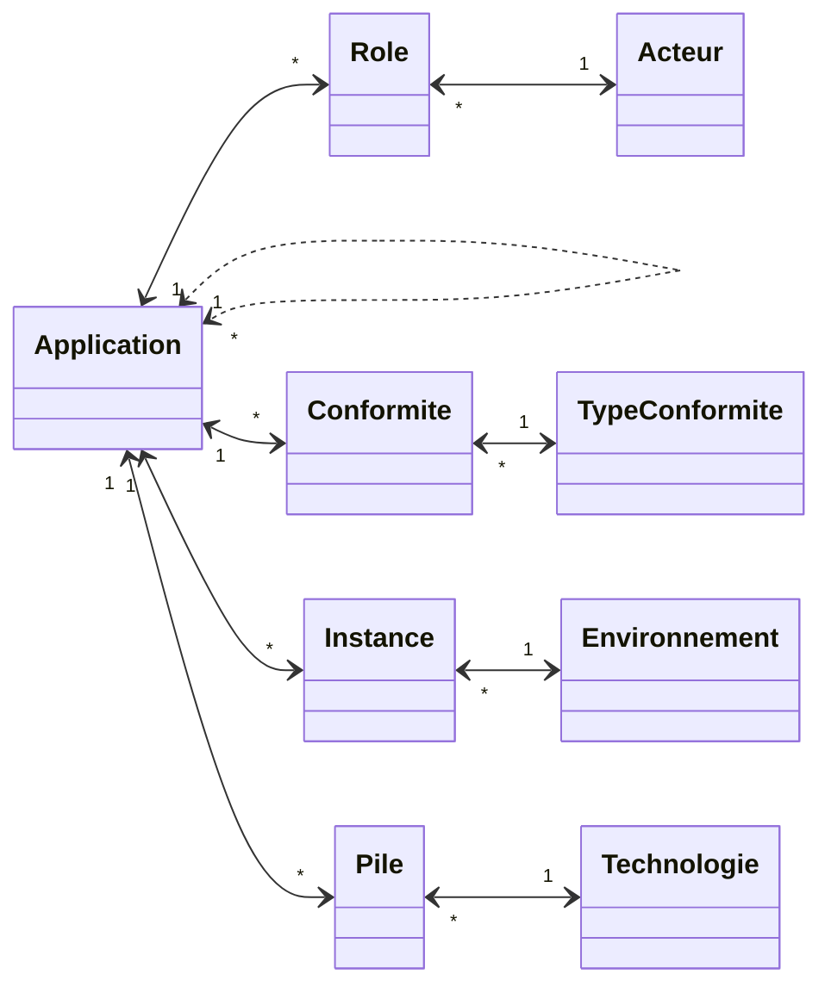

# Spécification du produit CANEL
spécifications canel

```mermaid
classDiagram
direction LR

class Application {
	}
class Role {
	}
class Acteur {
	}
class Conformite {
	}
class TypeConformite {
	}
class Environnement {
  }
class Instance {
  }
class Pile  {
  }
class Technologie {
  }
  
link Application "https://github.com/dnum-mi/canel-specs/blob/main/docs/Application.md" "Application"
link Role "https://github.com/dnum-mi/canel-specs/blob/main/docs/Application.md" "Role"
link Acteur "https://github.com/dnum-mi/canel-specs/blob/main/docs/Application.md" "Acteur"
link Conformite "https://github.com/dnum-mi/canel-specs/blob/main/docs/Application.md" "Conformite"
link TypeConformite "https://github.com/dnum-mi/canel-specs/blob/main/docs/Application.md" "TypeConformite"

link Environnement "https://github.com/dnum-mi/canel-specs/blob/main/docs/Environnement.md" "Environnement"
link Instance "https://github.com/dnum-mi/canel-specs/blob/main/docs/Environnement.md" "Instance"

link Technologie "https://github.com/dnum-mi/canel-specs/blob/main/docs/Technologie.md" "Technologie"
link Pile "https://github.com/dnum-mi/canel-specs/blob/main/docs/Technologie.md" "Pile"

Application "1" <--> "*" Role
Application "1" <..> "*" Application
Role "*" <--> "1" Acteur
Application "1" <--> "*" Conformite
Conformite "*" <--> "1" TypeConformite
Application "1" <--> "*" Instance
Instance "*" <--> "1" Environnement
Application "1" <--> "*" Pile
Pile "*" <--> "1" Technologie
```
