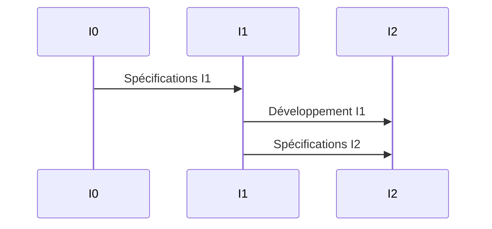
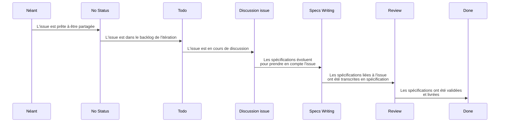

# Spécification du produit CANEL

Les spécifications du produit CANEL soint gérés sous GitHub.
Les évolutions de spécification du produit CANEL sont gérées au travers d'issues, tant pour la création de nouvelles fonctionnalités que pour l'évolution de celles existantes.
Le cadencement des spécifications suit les itérations de développement, de façon à fluidifier la transformation des spécifications en développement.

## Cycle de vie des spécifications

Un projet d'élément de spécification est formalisé dans une issue du repository canel-specs. Le traitement des issues de spécification est réalisé via le Kanban dui projet "canel-specs". Ce Kanban comprend les colonnes suivantes:

Lorsque ce projet est stabilisé, l'issue est positionnée dans la colonne "No Status" du kaban de gestion du projet "canel-specs".

Au lancement d'une itération de spécification:
- tout ou partie des issues "No Status" sont basculées dans la colonne "Todo" du Kanban.
- les issues présentes dans la colonne "Done" du Kanban sont retirées du projet.
- une branche d'évolution de specs est crée pour cette itération, nommée avec la date de fin de l'itération selon la nomenclature SPEC-AAAAMMJJ (ex: SPEC-20230624).

Lorsque les échanges commencent sur une issue, l'issue est déplacée dans la colonne "Discussion Issue".
Une fois l'issue stabilisée, elle est placée dans Specs Writing pour adaptation de la spécification.
Les spécifications sont modifiées dans la branche de l'itération.
Une fois les modifications portées, les issues sont déplacées dans la colonne Review.
Pour finaliser l'itération de spécification:
- Un "Pull Request" est émis sur la branche de l'itération.
- L'équipe de spécification revoit les spécifications résultantes et fusionne la branche d'itération avec la branche "main"
- Les issues de développement sont crées dans le repository de développement concerné, soit par rédaction directe, soit en tirant les issues de specs vers le repository de développement.
- Les issues de spécification sont closes dans le repository de spécification, et déplacées dans la colonne "Done" du Kanban.

