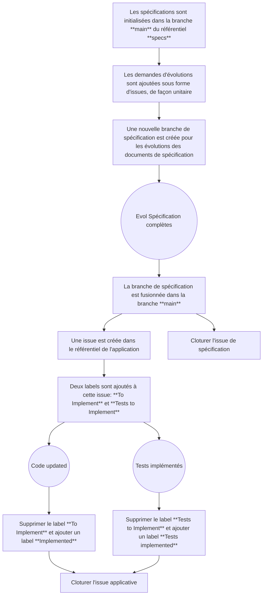
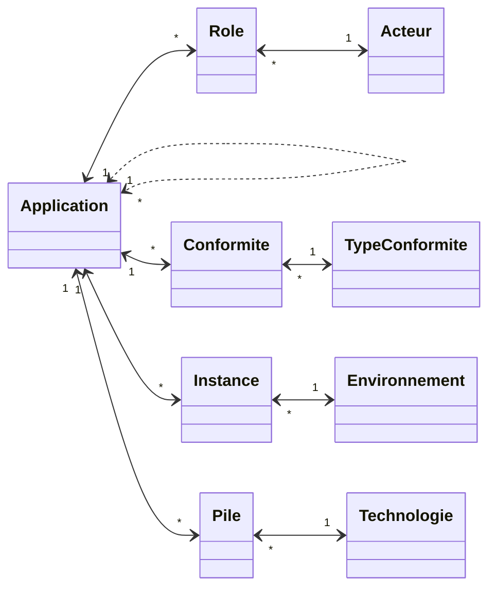

# Spécification du produit CANEL

## Modalités de gestion

Ce chapitre décrit les modalités de gestion des spécifications fonctionnelles du projet CANEL. Les spécifications sont réalisées au format markdown (md).
Nous disposons d'une spécification par objet. Pour l'usage de ces objets, des fiches de spécifications sont réalisées spécifiquement.

La branche **main** contient les spécifications validées du projet CANEL. Cette branche est initialisée avec l'état de l'application en cours.
Les remarques, propositions d'évolutions et besoins de nouvelles spécifications sont exprimées vies des **issues**.

Une **issue** peut avoir deux statut: OPEN ou CLOSED.

Les propositions d'évolution des spécifications sont faites au travers de branches, au travers des branches.
Lorsque la proposition est validée et formalisée dans la spécification, la branche est fondue dans la branche **main**.

Une nouvelle **issue** est alors créée dans le repository de l'application pour prise en compte.
Cette nouvelle **issue** est lors associée à deux labels: **Test to implement**, et **To implement**.
Lorsque les tests sont codés, le label **Test to implement** est supprimé, et un label **Test covergage OK** est ajouté.
Lorsque l'issue est prise en compte dans le code applicatif, le label **To implement** est supprimé, et un label **Implemented** est ajouté.

## Vue globale des objets

