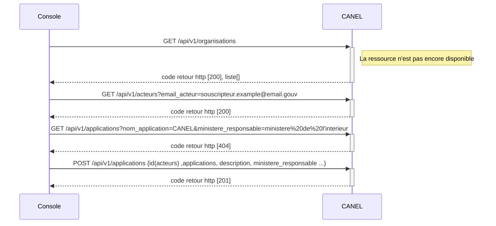
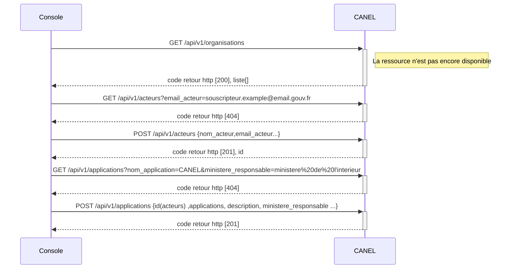
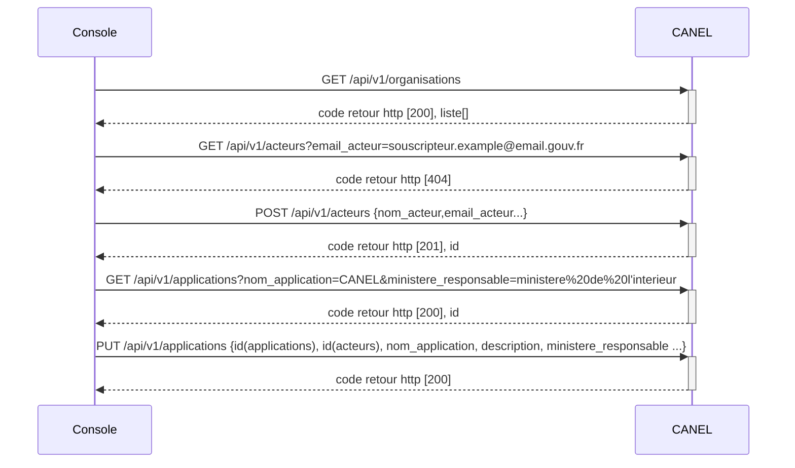
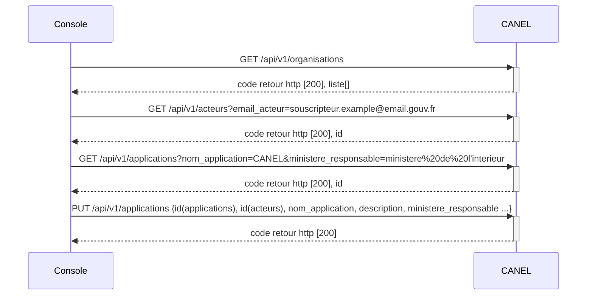

# Gestion des Applications

Une application, un applicatif ou encore une appli, une app est, dans le domaine informatique, un programme (ou un ensemble logiciel) directement utilisé pour réaliser une tâche, ou un ensemble de tâches élémentaires d'un même domaine ou formant un tout (Source: Wikipedia).
Une application peut être composée de sous-applications. Ces sous-applications sont aussi considérées comme des applications.

L'application est l'objet centrale du microservice Applications du service.

## Propriétés de l'objet Application

- **nom** de l'application [obligatoire]
- **Statut** de l'application [obligatoire] - Enum []
- lien vers des **identifiants** [facultatif] - lien vers une liste d'identifiants issus d'autre systèmes
	- CANEL1
	- BAI2
	- GSP2
	- PAI
- **description** [facultatif] - description de l'application, et plus particulièrement de son rôle fonctionnel.
- **date de mise en production** [facultatif] - correspond à une date d'ouverture du service aux utilisateurs.
- **Ministère responsable** [obligatoire]
- **Organisme** [obligatoire] - A REVOIR: doublon avec le ministère ? Ou les acteurs ?
- **lien vers application parent** [facultatif] - lien vers l'application contenant cette application, vide si tête de chaine
- **Sensibilité** [obligatoire] - Même définition que pour les instances - A REVOIR: une même application peut être déployée en NP et en DR; tout dépend des données gérées.
- **Type application** [obligatoire]
- **Zone urbanisation** [facultatif] - A REVOIR: externaliser ce concept hors de l'application: l'application peut être définie hors d'un plan d'urbanisme
- **Conformité** [facultatif] - A REVOIR
- **DevOps** [facultatif] - A REVOIR: définit les outils de la forge utilisée; peu signifiant dans ce contexte
- **commentaire** [facultatif]
- données de **création** [obligatoire] - auteur et date de création
- données de **modification** [facultatif] - auteur et date de modification

## Propriétés de l'objet Rôle

Un rôle associe un acteur à une application. Un rôle permet de définir l'implication d'un acteur dans une application, voire dans le cycle de vie du produit susjacent.

- lien vers une **application** [obligatoire]
- lien vers un **acteur** [obligatoire]
- **rôle** [obligatoire]
- **commentaire** [facultatif]
- données de **création** [obligatoire] - auteur et date de création
- données de **modification** [facultatif] - auteur et date de modification

## Propriétés de l'objet Acteur

Un acteur est nécessairement un individu.

- **Identfiant interne** [obligatoire]
- **email** [obligatoire] - donnée pivot des échanges applicatifs
- **actif** [obligatoire] - Vrai ou Faux - A REVOIR: pourrait être porté par le rôle plutôt que par l'acteur
- **entité rattachement** [facultatif] - fait sens  en interne MI, mais assez peu en dehors
- **habilitation*** [facultatif] - A REVOIR: le niveau d'habilitation est associé aux rôles que l'on peut jouer
- **nom** [obligatoire]
- **RIO** [facultatif] - A REVOIR: donnée spécifique MI; poour quel usage ?
- **Type** acteur [facultatif] - Enum []

## Sequence de création d'une application

La représentation des diagrammes de séquence précise les échanges sous forme d'API entre le console cloud pi native et CANEL.

Pour créer une nouvelle application, il est nécessaire de :
 - de vérifier la présence d'un utilisateur "souscripteur"
 - de créer l'utilisateur "souscripteur" s'il n'existe pas
 - de vérifier la présence d'une application
 - de créer l'application si elle n'existe pas
 - d'associer l'application au souscripteur existant ou au nouveau scripteur.

### Creation avec un acteur existant et une application inconnue

### Creation avec un acteur inconnu et une application inconnue

## Sequence de modification d'une application

La représentation des diagrammes de séquence précise les échanges sous forme d'API entre le console cloud pi native et CANEL.

Pour mettre à jour une nouvelle application existante, il est nécessaire de :
 - de vérifier la présence d'un utilisateur "souscripteur"
 - de créer l'utilisateur "souscripteur" s'il n'existe pas
 - de vérifier la présence d'une application
 - d'associer l'application au souscripteur existant ou au nouveau scripteur.

### Mise à jour avec un acteur inconnu et une application existante

`
Note : ajustement à faire pour le body du endpoint applications concernant l'association application/acteurs
`

### Mise à jour avec un acteur existant et une application existante

