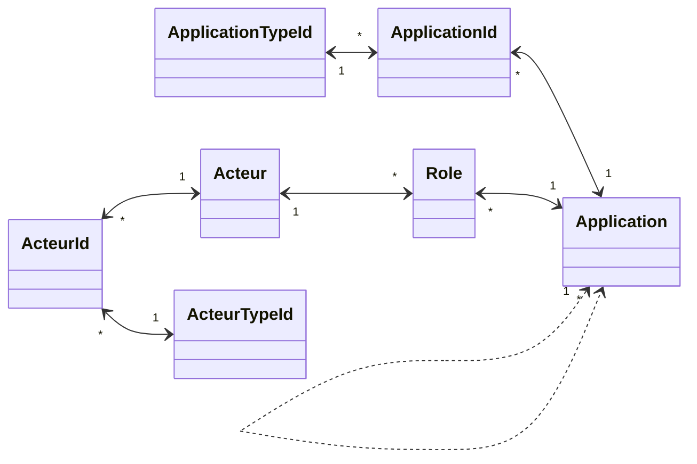

# Gestion des Applications

**_Objet_**
- Objet Application
- Objet ApplicationId
	- Objet ApplicationTypeId
- Objet Acteur
- Objet ActeurId
	- Objet ActeurTypeId
- Objet Role

**_Thèmes manquants ou à renforcer:_**
- Cycle de vie des objets
- stratégie de purge/nettoyage/anonymisation
- Définition des groupes et droits applicatifs

## Modèles de données

### Vue globale

### Objet Application

Une application, un applicatif ou encore une appli, une app est, dans le domaine informatique, un programme (ou un ensemble logiciel) directement utilisé pour réaliser une tâche, ou un ensemble de tâches élémentaires d'un même domaine ou formant un tout (Source: Wikipedia).
Une application peut être composée de sous-applications. Ces sous-applications sont aussi considérées comme des applications.

L'application est l'objet central du microservice Applications du service.

- **nom** de l'application [obligatoire]
- **Statut** de l'application [obligatoire] - lien vers une table de référence portant les statuts possibles d'une application:
	- En Construction: l'application est en cours de d'édition (développement, intégration)
	- En Production: l'application est déployée sur sa plateforme de production; le service peut être ouvert ou non
	- En cours de retrait de service: l'application est inscrite sur une trajectoire de retrait, mais est toujours opérationnelle
	- Retirée du service: l'accès opérationnel à l'application n'est plus ouvert, mais les instances sont maintenues (contraintes techniques ou réglementaires)
	- Décommissionnée: l'application a été physiquement retirée des plateformes de production
- **description** [facultatif] - description de l'application, et plus particulièrement de son rôle fonctionnel.
- **date de mise en production** [facultatif] - correspond à une date d'ouverture du service aux utilisateurs.
- **Organisme responsable** [obligatoire] - organisme (ministère, agence, ...) propriétaire de l'application
- **Organisation projet** [facultatif] - Enum[Agile, Cycle en V, Hybride] - Issue #8
- **lien vers application parent** [facultatif] - lien vers l'application contenant cette application, vide si tête de chaine
- **Sensibilité** [obligatoire] - Enum [S1:standard, S2:Sensible, S3:système essentiel, S4: système d'importance vitale] Cette information a des impacts sur le niveau de disponibilité et de confidentialité de l'application
- **Type application** [facultatif] - Enum [Site communication internet, Site communication intranet, Service métier, Service tranverse, Service socle]
	- Site de communication internet: Système applicatif donc le but est de communiquer des informations à l'extérieur du MIOM; il peut inclure un CMS 
	- Site de communication intranet: Système applicatif donc le but est de communiquer des informations à l'intérieur du MIOM; il peut inclure un CMS
	- Service Métier: application à finalité des métiers
	- Service Transverse: applications utilisables selon les besoins par des utilisateurs ou d'autres applications, mais non obligatoires au regard du service offert
	- Service Socle: application nécessaire au fonctionnement d'une plateforme, y compris ses moyens d'exploitation
- **Zone urbanisation** [facultatif] - A REVOIR: externaliser ce concept hors de l'application: l'application peut être définie hors d'un plan d'urbanisme
- **Conformité** [facultatif]
- **DevOps** [facultatif]
- **commentaire** [facultatif]
- données de **création** [obligatoire] - auteur et date de création
- données de **modification** [facultatif] - auteur et date de modification

##### Unicité
Dans notre contexte, l'unicité d'une application est contrôlée. Une application est dite unique dés lors qu'elle n'est référencée qu'une seule fois pour un même organisme.

Les scénari suivants indiquent les éléments qui peuvent être inscrits dans le référentiel et celui qui est rejeté  :
|Nom|organismes|actions|etat|
|----|-------|-----|----|
|CANEL|MI|enregistré|OK|
|CANEL|MJ|enregistré|OK|
|CANEL|MI|tentative d'inscription|KO|

A l'issue du contrôle, le service renvoie au système à l'initiative de la demande :
- une indication d'enregistrement (etat: OK);
- une indication de rejet/conflit (etat: KO).

#### Requirements (lang:EN)

|  ReqID  |  Context | Requirement Description | Comments |
|---------|----------|-------------------------|----------|
| APP-001 | POST     | The applicationId is generated while application recording in DB. |  |
| APP-002 | GET      | Answer contains all direct attributes of application object. Children applications [enfantsApplication] is an array of applications with only the direct attributes. Parent application [parentApplication] is an application object with only its direct attributes. CodeApplication [codeApplication] is an array of external codes applicable to the current application object. Roles [acteurRoles] is an array of roles, where the organisation is always filled. If the actor is filled, the organisation is the actor's one. Incoming and Output flows [fluxEntrant and fluxSortant] is an array of flow objects  with the flows direct attributes and either the application object with its direct attributes or the organisation with its direct attributes. Instances [instances] is an array of instance objects with their direct attributes and the environnement object with its direct attributes. Capabilities [capacites] is an array of capabilities directly associated with the current application, described with their direct attributes, the name (and id) of parent capability is existing. Urban Zones [zonesUrbanisme] is an array of urban zone objects directly associated with the current application, described with their direct attributes, the name (and id) of parent zone is existing. Compliance [conformite] is an array of compliance objects with their direct attributes. | This requirement is complex, and covers all the object required independantly of the planification. So it has to be considered in this way |
| APP-003 | POST/PUT | we must ensure that the applicationName is unique for an organisation; the couple (applicationName+organisationId) is unique |  |
| APP-004 | POST     | By default, the application status is set as "En construction" (code BLD) |  |
| APP-005 | POST/PUT | if an actor is associated with an application (via role), but unknown into the DB, it will be created. The existence test is based on the email address. |  |
| APP-006 | POST/PUT | if an organisation is associated with the application (as owner organisation, via a role, or as couterpart of flow) but unknown into the DB, it will be created. Its existence test is based on the couple (name+parentId) |  |
| APP-007 | POST/PUT | if a capability is associated with the application, but not existing into the DB, it will be created. The existence test is based on the capability name. | WARNING: we could link an application to the wrong capability, because capabilities could have the same name with different parents. |
| APP-008 | POST/PUT | a compliance record is created if the complianceType is not existing for this application, either, it is updated - unicity of applicationId+complianceType |  |
| APP-009 | POST/PUT | the sensitivity attribute, when upgraded (ex.: S1 to S2), has to be propagated to sub applications if the curent sensitivity of thos sub applications is lower than the new value. If the update of this attribute is downgraded (ex: S3 to S2), we don't propagate the update. |  |
### Objet ApplicationId

Cet objet a pour but de d'associer des identifiants d'application issus de référentiels externes aux objets applications.
- lien vers une **Application** [obligatoire]
- lien vers un **ApplicationTypeId** [obligatoire]
- valeur [obligatoire] valeur de l'identifiant de cette application selon le type
- **commentaire** [facultatif]
- données de **création** [obligatoire] - auteur et date de création
- données de **modification** [facultatif] - auteur et date de modification

#### Objet ApplicationTypeId

Cet objet permet de définir les types d'identifiants associables avec une application. Il contient les valeurs suivantes:
- CANEL1
- BAI2
- GSP2
- PAI
 
Les attributs de cet objet sont:

- **label** [obligatoire] libellé court du type d'identifiant
- **description** [facultatif] description du type d'identifiant, inclut la référence au SI maître
- lien vers **SI de référence** [facultatif] lien vers le SI gérant les identifiants de ce type

### Objet Rôle

Un rôle associe un acteur à une application. Un rôle permet de définir l'implication d'un acteur dans une application, voire dans le cycle de vie du produit susjacent.

- lien vers une **application** [obligatoire]
- lien vers un **acteur** [obligatoire]
- **rôle** [obligatoire] - lien vers une table de référence contenant les rôles possibles pour un acteur sur une application:
	- Chef de Projet/Product Owner
	- MOA/Business Owner
	- Architecte Solution
	- Architecte Infra
	- MOE
	- Resp Production
	- Support
	- RSSI
	- Souscripteur
- date d'**échéance** de l'information [obligatoire] date renseignée automatiquement lors de la mise à jour de cette information. comme <date de mise à jour>+<délai> où le délai est une donnée paramétrée de l'application
- **commentaire** [facultatif]
- données de **création** [obligatoire] - auteur et date de création
- données de **modification** [obligatoire] - auteur et date de modification ; initialisation avec les données de création

10 jours (délai paramétrable) avant l'échéance d'un rôle, un message doit être envoyé aux autres acteurs de l'application soutenue pour les informer de cette échéance. Le contenu du message doit être paramétrable.

### Objet Acteur

Un acteur est nécessairement un individu.

- **Identfiant interne** [obligatoire]
- **email** [obligatoire] - donnée pivot des échanges applicatifs
- **actif** [obligatoire] - Vrai ou Faux - A REVOIR: pourrait être porté par le rôle plutôt que par l'acteur
- **entité rattachement** [facultatif] - Employeur de l'acteur: Ministères décrits par leur libellé long. Pour les sous-traitants, il s'agit de la société d'emploi (ESN)
- **nom** [obligatoire]
- date d'**échéance** de l'acteur [obligatoire] - date calculée selon les règles suivantes:
	- date maximum d'échéance des rôles associés
	- en cas d'absence de rôle: date de dernière modification de l'acteur + délai paramétré des rôles
- **commentaire** [facultatif] texte libre
- données de **création** [obligatoire] - auteur et date de création
- données de **modification** [obligatoire] - auteur et date de modification; initialisation avec les données de création

Un traitement "batch" doit être prévu pour sélectionner tous les acteurs avec une date d'échéance + un délai d'un an (paramétrable), et anonymiser les noms et email.

#### Requirements (lang:EN)

|  ReqID  |  Context | Requirement Description | Comments |
|---------|----------|-------------------------|----------|
| ACT-001 | POST     | The actorId is generated while application recording in DB. |  |
| ACT-002 | POST     | Fields name and email are required. |  |
| ACT-003 | POST/PUT | ValidationDate is calculated as the latest role validationDate associated at the current Actor, or the last creation/update date added with 730 days; the "730" value must be parameterizable (via config file at least) |  |
| ACT-004 | POST/PUT | An actor can be associated (optional) with external ids. Every id must be unique for a type (actorId+actorCodeType is unique) |  |
| ACT-005 | POST/PUT | The email is unique into the database |  |
| ACT-006 | POST/PUT | In case of creation request for an actor, in case of exisyting email into the DB, the found record is updated (no creation). The creation occurs only if there is no actor with the pushed email. |  |

### Objet ActeurId

Cet objet a bour but d'associer des identifiants issus de référentiels externes à des acteurs. La liste des types d'identifiants est définie via l'objet TypeIdActeur.

- lien vers un **Acteur** [obligatoire]
- lien vers un **Type d'Identifiant d'Acteur** [obligatoire]
- valeur [obligatoire] valeur de l'identifiant de cet acteur selon le type
- **commentaire** [facultatif]
- données de **création** [obligatoire] - auteur et date de création
- données de **modification** [facultatif] - auteur et date de modification

#### Objet ActeurTypeId

Cet objet permet de définir les types d'identifiants associables avec un acteur. Par exemple, il peut contenir les valeurs suivantes:

- **RIO**: identifiant interne du Ministère de l'intérieur
 
Les attributs de cet objet sont:

- **label** [obligatoire] libellé court du type d'identifiant
- **description** [facultatif] description du type d'identifiant, inclut la référence au SI maître
- lien vers **SI de référence** [facultatif] lien vers le SI gérant les identifiants de ce type

