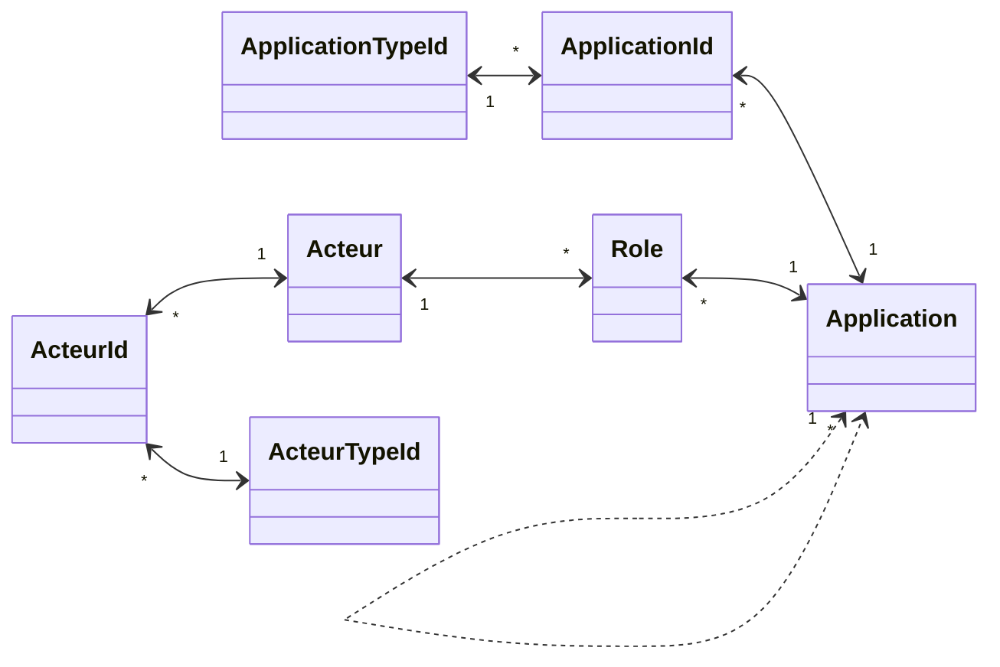
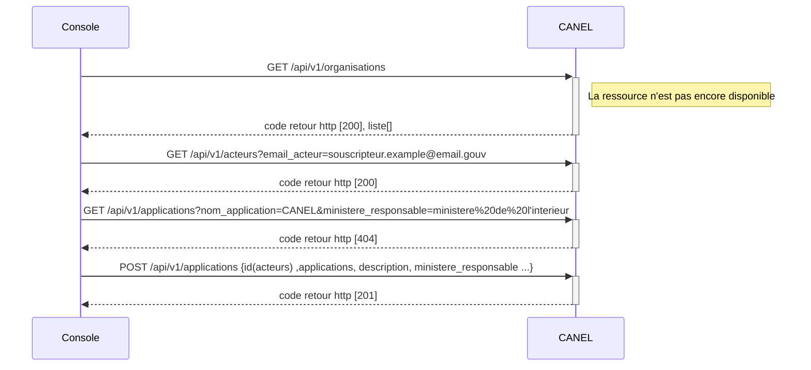
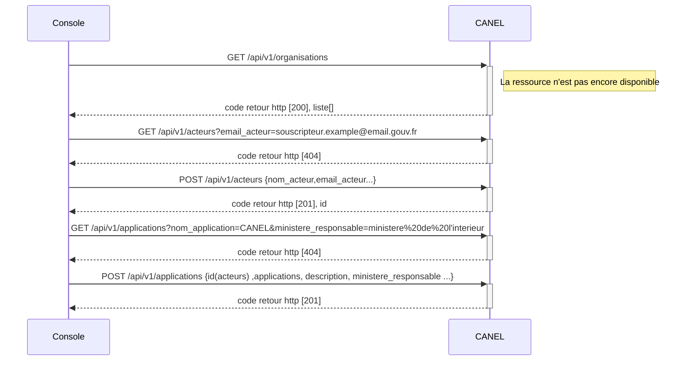
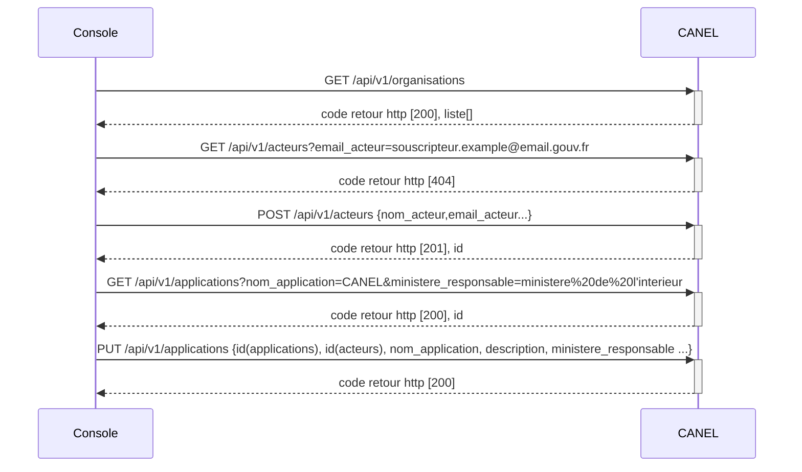
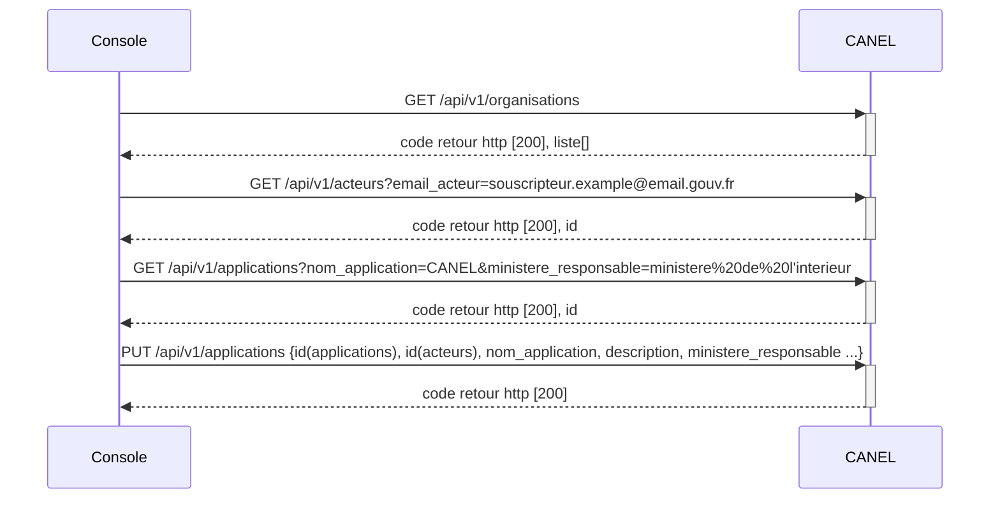

# Gestion des Applications

**_Objet_**
- Objet Application
- Objet ApplicationId
	- Objet ApplicationTypeId
- Objet Acteur
- Objet ActeurId
	- Objet ActeurTypeId
- Objet Role

**_Thèmes manquants ou à renforcer:_**
- Cycle de vie des objets
- stratégie de purge/nettoyage/anonymisation
- Définition des groupes et droits applicatifs

## Modèles de données

### Vue globale

### Objet Application

Une application, un applicatif ou encore une appli, une app est, dans le domaine informatique, un programme (ou un ensemble logiciel) directement utilisé pour réaliser une tâche, ou un ensemble de tâches élémentaires d'un même domaine ou formant un tout (Source: Wikipedia).
Une application peut être composée de sous-applications. Ces sous-applications sont aussi considérées comme des applications.

L'application est l'objet central du microservice Applications du service.

- **nom** de l'application [obligatoire]
- **Statut** de l'application [obligatoire] - lien vers une table de référence portant les statuts possibles d'une application:
	- En Construction: l'application est en cours de d'édition (développement, intégration)
	- En Production: l'application est déployée sur sa plateforme de production; le service peut être ouvert ou non
	- En cours de retrait de service: l'application est inscrite sur une trajectoire de retrait, mais est toujours opérationnelle
	- Retirée du service: l'accès opérationnel à l'application n'est plus ouvert, mais les instances sont maintenues (contraintes techniques ou réglementaires)
	- Décommissionnée: l'application a été physiquement retirée des plateformes de production
- **description** [facultatif] - description de l'application, et plus particulièrement de son rôle fonctionnel.
- **date de mise en production** [facultatif] - correspond à une date d'ouverture du service aux utilisateurs.
- **Organisme responsable** [obligatoire] - organisme (ministère, agence, ...) propriétaire de l'application
- **Organisation projet** [facultatif] - Enum[Agile, Cycle en V, Hybride] - Issue #8
- **lien vers application parent** [facultatif] - lien vers l'application contenant cette application, vide si tête de chaine
- **Sensibilité** [obligatoire] - Enum [S1:standard, S2:Sensible, S3:système essentiel, S4: système d'importance vitale] Cette information a des impacts sur le niveau de disponibilité et de confidentialité de l'application
- **Type application** [facultatif] - Enum [microservices, n-tiers, plateforme valorisation de données, site internet, site intranet] - A REVOIR: donnée complexe par rapport à cas d'usages
- **Zone urbanisation** [facultatif] - A REVOIR: externaliser ce concept hors de l'application: l'application peut être définie hors d'un plan d'urbanisme
- **Conformité** [facultatif]
- **DevOps** [facultatif]
- **commentaire** [facultatif]
- données de **création** [obligatoire] - auteur et date de création
- données de **modification** [facultatif] - auteur et date de modification

### Objet ApplicationId

Cet objet a pour but de d'associer des identifiants d'application issus de référentiels externes aux objets applications.
- lien vers une **Application** [obligatoire]
- lien vers un **ApplicationTypeId** [obligatoire]
- valeur [obligatoire] valeur de l'identifiant de cette application selon le type
- **commentaire** [facultatif]
- données de **création** [obligatoire] - auteur et date de création
- données de **modification** [facultatif] - auteur et date de modification

#### Objet ApplicationTypeId

Cet objet permet de définir les types d'identifiants associables avec une application. Il contient les valeurs suivantes:
- CANEL1
- BAI2
- GSP2
- PAI
 
Les attributs de cet objet sont:

- **label** [obligatoire] libellé court du type d'identifiant
- **description** [facultatif] description du type d'identifiant, inclut la référence au SI maître
- lien vers **SI de référence** [facultatif] lien vers le SI gérant les identifiants de ce type

### Objet Rôle

Un rôle associe un acteur à une application. Un rôle permet de définir l'implication d'un acteur dans une application, voire dans le cycle de vie du produit susjacent.

- lien vers une **application** [obligatoire]
- lien vers un **acteur** [obligatoire]
- **rôle** [obligatoire] - lien vers une table de référence contenant les rôles possibles pour un acteur sur une application:
	- Chef de Projet/Product Owner
	- MOA/Business Owner
	- Architecte Solution
	- Architecte Infra
	- MOE
	- Resp Production
	- Support
	- RSSI
	- Souscripteur
- **commentaire** [facultatif]
- données de **création** [obligatoire] - auteur et date de création
- données de **modification** [facultatif] - auteur et date de modification

### Objet Acteur

Un acteur est nécessairement un individu.

- **Identfiant interne** [obligatoire]
- **email** [obligatoire] - donnée pivot des échanges applicatifs
- **actif** [obligatoire] - Vrai ou Faux - A REVOIR: pourrait être porté par le rôle plutôt que par l'acteur
- **entité rattachement** [facultatif] - Employeur de l'acteur: Ministères décrits par leur libellé long. Pour les sous-traitants, il s'agit de la société d'emploi (ESN)
- **nom** [obligatoire]

### Objet ActeurId

Cet objet a bour but d'associer des identifiants issus de référentiels externes à des acteurs. La liste des types d'identifiants est définie via l'objet TypeIdActeur.

- lien vers un **Acteur** [obligatoire]
- lien vers un **Type d'Identifiant d'Acteur** [obligatoire]
- valeur [obligatoire] valeur de l'identifiant de cet acteur selon le type
- **commentaire** [facultatif]
- données de **création** [obligatoire] - auteur et date de création
- données de **modification** [facultatif] - auteur et date de modification

#### Objet ActeurTypeId

Cet objet permet de définir les types d'identifiants associables avec un acteur. Par exemple, il peut contenir les valeurs suivantes:

- **RIO**: identifiant interne du Ministère de l'intérieur
 
Les attributs de cet objet sont:

- **label** [obligatoire] libellé court du type d'identifiant
- **description** [facultatif] description du type d'identifiant, inclut la référence au SI maître
- lien vers **SI de référence** [facultatif] lien vers le SI gérant les identifiants de ce type

## Cas d'usage

### Sequence de création d'une application

La représentation des diagrammes de séquence précise les échanges sous forme d'API entre le console cloud pi native et CANEL.

Pour créer une nouvelle application, il est nécessaire de :
 - de vérifier la présence d'un utilisateur "souscripteur"
 - de créer l'utilisateur "souscripteur" s'il n'existe pas
 - de vérifier la présence d'une application
 - de créer l'application si elle n'existe pas
 - d'associer l'application au souscripteur existant ou au nouveau scripteur.

#### Creation avec un acteur existant et une application inconnue

#### Creation avec un acteur inconnu et une application inconnue

### Sequence de modification d'une application

La représentation des diagrammes de séquence précise les échanges sous forme d'API entre le console cloud pi native et CANEL.

Pour mettre à jour une nouvelle application existante, il est nécessaire de :
 - de vérifier la présence d'un utilisateur "souscripteur"
 - de créer l'utilisateur "souscripteur" s'il n'existe pas
 - de vérifier la présence d'une application
 - d'associer l'application au souscripteur existant ou au nouveau scripteur.

#### Mise à jour avec un acteur inconnu et une application existante

`
Note : ajustement à faire pour le body du endpoint applications concernant l'association application/acteurs
`

#### Mise à jour avec un acteur existant et une application existante

