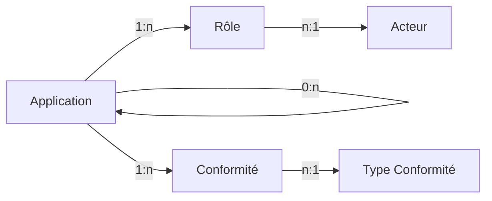
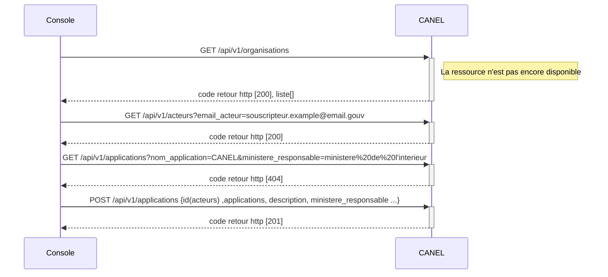
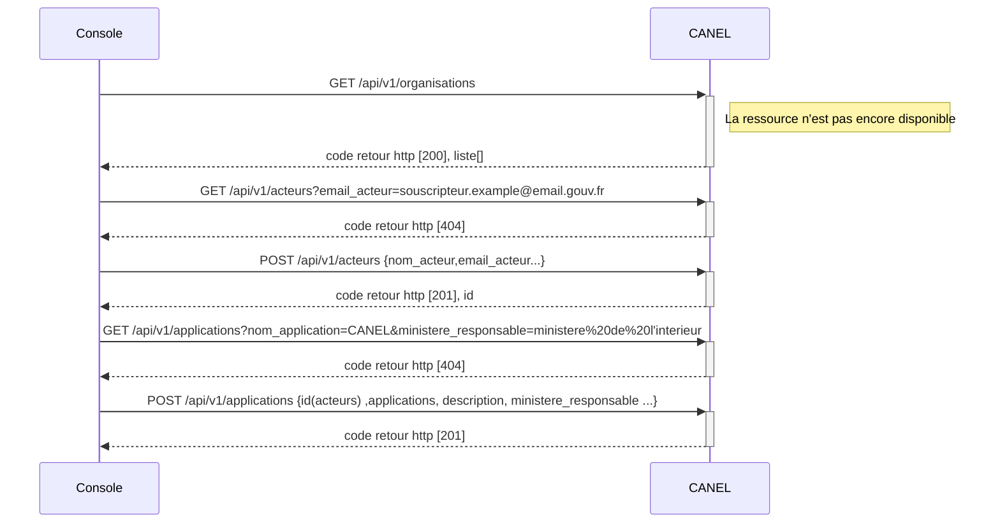
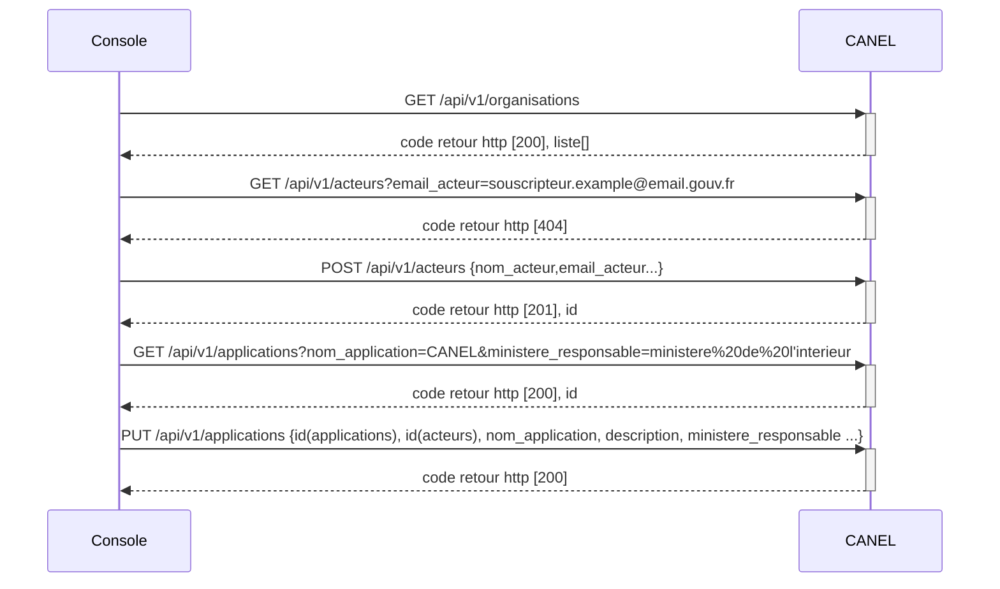
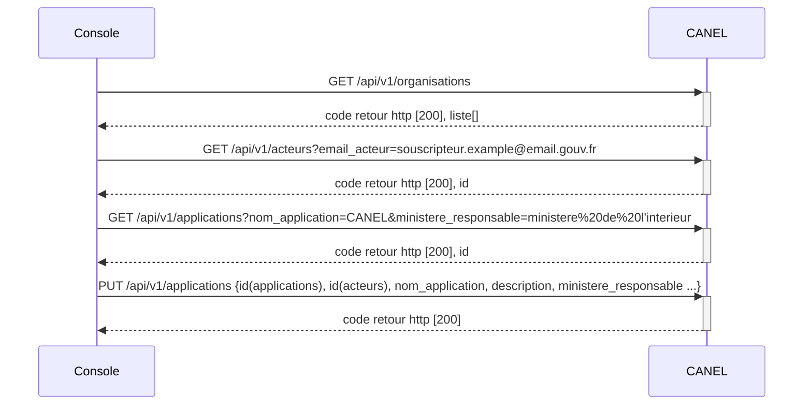

# Gestion des Applications

**_Version_** : en cours

**_Discussions_** ouvertes
- Objet Application: 10
- Objet Acteur: 3
- Objet Role: 2
- Objet Conformité: 1

**_Thèmes manquants ou à renforcer:_**
- Cycle de vie des objets
- stratégie de purge/nettoyage/anonymisation
- Définition des groupes et droits applicatifs

## Modèles de données

### Vue globale

### Objet Application

Une application, un applicatif ou encore une appli, une app est, dans le domaine informatique, un programme (ou un ensemble logiciel) directement utilisé pour réaliser une tâche, ou un ensemble de tâches élémentaires d'un même domaine ou formant un tout (Source: Wikipedia).
Une application peut être composée de sous-applications. Ces sous-applications sont aussi considérées comme des applications.

L'application est l'objet central du microservice Applications du service.

- **nom** de l'application [obligatoire]
- **Statut** de l'application [obligatoire] - Enum [En construction, En production, En cours de retrait, Mise en extinction, Décommissionnée, Identifiée dans la trajectoire] - A REVOIR: la liste pose question, et doit être alignée avec les statuts des instances.
- lien vers des **identifiants** [facultatif] - lien vers une liste d'identifiants issus d'autre systèmes
	- CANEL1
	- BAI2
	- GSP2
	- PAI
- **description** [facultatif] - description de l'application, et plus particulièrement de son rôle fonctionnel.
- **date de mise en production** [facultatif] - correspond à une date d'ouverture du service aux utilisateurs.
- **Ministère responsable** [obligatoire]
- **Organisation projet** [facultatif] - Enum[Agile, Cycle en V, Hybride] - A REVOIR: concerne un projet, pas une application
- **lien vers application parent** [facultatif] - lien vers l'application contenant cette application, vide si tête de chaine
- **Sensibilité** [obligatoire] - Enum [S1:standard, S2:Sensible, S3:système essentiel, S4: système d'importance vitale] Cette information a des impacts sur le niveau de disponibilité et de confidentialité de l'application
- **Type application** [obligatoire] - Enum [microservices, n-tiers, plateforme valorisation de données, site internet, site intranet] - A REVOIR: donnée complexe par rapport à cas d'usages
- **Zone urbanisation** [facultatif] - A REVOIR: externaliser ce concept hors de l'application: l'application peut être définie hors d'un plan d'urbanisme
- **Conformité** [facultatif] - A REVOIR - point vers une table conformité, mais qui est à revoir
- **DevOps** [facultatif] - A REVOIR: définit les outils de la forge utilisée; peu signifiant dans ce contexte
- **commentaire** [facultatif]
- données de **création** [obligatoire] - auteur et date de création
- données de **modification** [facultatif] - auteur et date de modification

### Objet Rôle

Un rôle associe un acteur à une application. Un rôle permet de définir l'implication d'un acteur dans une application, voire dans le cycle de vie du produit susjacent.

- lien vers une **application** [obligatoire]
- lien vers un **acteur** [obligatoire]
- **rôle** [obligatoire] - Enum[architecte, souscripteur] - A REVOIR: enrichir hors des cas DSO stricts 
- **commentaire** [facultatif]
- données de **création** [obligatoire] - auteur et date de création
- données de **modification** [facultatif] - auteur et date de modification

### Objet Acteur

Un acteur est nécessairement un individu.

- **Identfiant interne** [obligatoire]
- **email** [obligatoire] - donnée pivot des échanges applicatifs
- **actif** [obligatoire] - Vrai ou Faux - A REVOIR: pourrait être porté par le rôle plutôt que par l'acteur
- **entité rattachement** [facultatif] - fait sens  en interne MI, mais assez peu en dehors
- **habilitation*** [facultatif] - A REVOIR: le niveau d'habilitation est associé aux rôles que l'on peut jouer
- **nom** [obligatoire]
- **RIO** [facultatif] - A REVOIR: donnée spécifique MI; poour quel usage ?
- **Type** acteur [facultatif] - Enum [architecte, responsable d'exploitation, responsable metier, responsable MOE, responsable sécurité, responsable technique, souscripteur] - A REVOIR: ces types sont en fait des rôles sur des applications, des projets, ...

### Objet Conformité

L'objet Conformité décrit l'état de mise en conformité d'une application par rapport à une contrainte réglementaire ou normative.
Pour être exact, il devrait concerné une version précise de l'application, voire une instance déployée, et non l'application dans son ensemble. Toutefois, pour des raisons de maintenabilité du modèle, nous associons cet objet directement à l'objet Application.

- lien vers une **Application** [obligatoire]
- lien vers un **Type de Conformité** [obligatoire]
- **Niveau de conformité** [obligatoire] un peu compliqué, car cela peut dépendre du type de conformité concerné; une homologation permet un niveau APE, Standard,  ... tandis que le DSFR entrainera un pourcentage ...
- **Date Audit** [facultatif] ne précise pas la nature de l'audit pour offrir plus de flexibilité
- **Statut Audit** [obligatoire] - Enum[N/A,  Non réalisé, En cours, Validé, Rejeté]
	- **_N/A_**: pas d'audit requis pour le type de conformité concerné
	- **_Non réalisé_**: audit requis, mais pas encore réalisé
	- **_En cours_**: audit en cours de réalisation A REVOIR:  statut un peu fin à maintenir
	- **_Validé_**: l'audit est terminé, et considéré comme valide (ce qui peut être contextuel)
	- **_Rejeté_**: l'audit est terminé, mais son résultat nécessite des adaptations
- **Date décision conformité** [facultatif]
- **Date échéance conformité** [facultatif] Mais devrait être renseigné dès que l'information existe

### Objet Type Conformité

Les types de conformité listent les différentes réglementations structurant les produits numériques produits et exploités.
La distinction via un objet distinct permet de disposer d'une liste des contraintes qui soit évolutive.

- **Label** [obligatoire] Libellé court du type de conformité - clé primaire de l'objet (ex: RGAA, DSFR, RSSI, ...)
- **Description** [obligatoire] Description du champ de réglementation applicable
- **Reference** [facultatif] Lien vers la documentation de référence de la réglementation applicable

## Cas d'usage

### Sequence de création d'une application

La représentation des diagrammes de séquence précise les échanges sous forme d'API entre le console cloud pi native et CANEL.

Pour créer une nouvelle application, il est nécessaire de :
 - de vérifier la présence d'un utilisateur "souscripteur"
 - de créer l'utilisateur "souscripteur" s'il n'existe pas
 - de vérifier la présence d'une application
 - de créer l'application si elle n'existe pas
 - d'associer l'application au souscripteur existant ou au nouveau scripteur.

#### Creation avec un acteur existant et une application inconnue

#### Creation avec un acteur inconnu et une application inconnue

### Sequence de modification d'une application

La représentation des diagrammes de séquence précise les échanges sous forme d'API entre le console cloud pi native et CANEL.

Pour mettre à jour une nouvelle application existante, il est nécessaire de :
 - de vérifier la présence d'un utilisateur "souscripteur"
 - de créer l'utilisateur "souscripteur" s'il n'existe pas
 - de vérifier la présence d'une application
 - d'associer l'application au souscripteur existant ou au nouveau scripteur.

#### Mise à jour avec un acteur inconnu et une application existante

`
Note : ajustement à faire pour le body du endpoint applications concernant l'association application/acteurs
`

#### Mise à jour avec un acteur existant et une application existante

