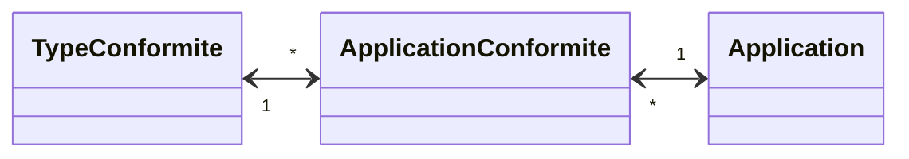

# Gestion de la conformité des applications

Le but de cette spécification est de décrire la gestion des informations de conformité règlementaire des applications.

L'objet Application est décrit dans le fichier Application.md.

## Objet TypeConformite

Cet objet décrit les différents types de conformité applicables à une application. Ces conformités sont issues de contraintes réglementaires. Les valeurs possibles sont:
- SSI : Homologation de sécurité
- RGAA : réglementation d'accessibilité d'une application
- RGPD : réglementation de gestion des données à caractère personnel

## Objet ApplicationConformite

La conformité d'une application peut être partielle ou totale selon le type de conformité. Cette contrainte conditionnelle n'est pas gérée dans le modèle.
Une conformité peut être limitée dans le temps (cas SSI) ou non (RGAA, RGPD), mais dans le second cas, l'évolution de l'application peut remettre en cause cette conformité. Pour le moment, pas de gestion de cette remise en cause.

- lien vers une **Application** [obligatoire]
- lien vers un **TypeConformite** [obligatoire]
- **niveau** de conformité [obligatoire] - valeur issue d'une table de référence
	- Dispensée : l'application n'est pas soumise à cette conformité
	- Non passée : l'application est soumise à cette conformité, mais n'a pas encore été évaluée
	- Partielle : la conformité a été évaluée, mais le résultat comprend des réserves
	- Complète : la conformité a été évaluée, et le résultat ne comprend pas de réserves
- **date décision** de conformité [facultatif] : date de l'instance ayant prononcée la conformité
- **date d'échéance** de conformité [facultatif] : date jusqu'à laquelle la conformité est valable
- **date d'audit** [facultatif] : date de retour de l'audit évaluant le niveau de conformité
- **commentaire** [facultatif]
- données de **création** [obligatoire] - auteur et date de création
- données de **modification** [facultatif] - auteur et date de modification

Dans le cas d'un niveau partiel, par exemple le RGAA, il est recommandé d'indiquer le taux de conformité dans le commentaire.
