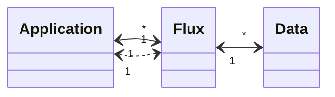

# Flux de données inter-applications

Un flux de données définit le contrat d'échange d'information entre deux applications.
Il peut être décrit comme suit:
- **Application source** - application initiant techniquement l'échange
- **Application cible** - en conséquence de la définition de la source, ce peut être un serveur (qd le client initie l'appel).
- **Intermédiaire** [facultatif] - texte décrivant les SI techniques intermédiant l'échange (par exemple: INES)
- **Type de flux** [facultatif] - liste de valeurs [API REST, Web Service, FTP, ODBC, JDBC, ...]
- **Protocole de transport** [obligatoire] - parmi [HTTP, HTTPS, TCP, SFTP]
- **Ports** [facultatif] - texte, car possibilité de valeurs multiples.
- **Frequence** [obligatoire] Enum[périodique, sur demande] 
- **Ensemble des données** portées dans le flux (lien 1-n)
    - **_donnée_** [obligatoire] - identifiant de la donnée dans le référentiel des données - en attendant un référentiel de données, on peut indiquer ici un nom de donnée.
    - **_description_** [facultatif] - en attendant un référentiel de données, on peut décrire succinctement la donnée dans ce champ; lorsque le référentiel de données sera validé, cette description reprendra la description du référentiel.
- **Commentare** [facultatif] - texte libre
- Données de **création** [obligatoire] identité de l'utilisateur créant la ligne, et date de la création
- Données de **modification** [obligatoire] identité de l'utilisateur créant la ligne, et date de la création - par défaut égal aux données de création

Dans le cas d'un échange via API, la philosophie serait de définir un composant application comme API d'un SI. Ce composant serait relié par un flux au SI de gestion. L'accès à une API à partir d'une application n'est pas décrit vers une API Gateway, car cette dernière est considérée comme un intermédiaire.

Le sens du flux peut poser difficulté dans le cas d'un échange de fichier avec dépôt/acquisition (ex: FTP). Dans ce cas, la source est l'application émettant le fichier.

