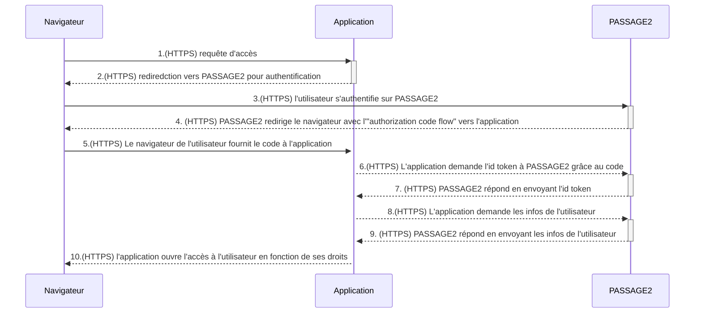

# Gestion des droits des utilisateurs

**_Version_** : en cours

**_Discussions_** ouvertes

**_Thèmes manquants ou à renforcer:_**

## Hypothèses de départ
Un utilisateur non identifié peut accèder aux informations de base qui décrivent une application.
Un utilisateur identifié peut accèder aux informations disponibles selon le rôle qui lui a été attribué. 
Un utilisateur est identifié dans la table "Acteur"
La description de ces droits décrits dans ce document est limitée aux objets suivants:
- Acteur
- Rôle
- Application
- Conformité
- Environnement
- Instance
- Données de référence

Les droits sont de type CRUD (Create - Read - Update - Delete)

## Authentification d'un utilisateur
- Un utilisateur doit s'authentifier via Passage2.
- L'authentification via Passage2 peut permettre à l'utilisateur d'être associé à un acteur. Dans le cas contraire, l'utilisateur a un accès limité aux informations du référentiel.
- Les accès via la Console DSO du Cloud PI Native sont supposés de confiance.
- Les appels d'API à partir de la Console DSO permettent de créer éventuellement un acteur correspondant à l'utilisateur connecté à la console, une application correspondant à l'usage de la console, et d'un rôle de "responsable d'application" reliant cet acteur et cette application.

### Mécanisme d'authentification PASSAGE2-CLIENT-API

- Dans le cas d'un accès par PASSAGE2, le reférentiel des applications sera proposé par défaut sur le portail du SSO. Lors de la sollicitation d'un accès par l'utilisateur via le SSO, le service appelant (SSO) est identifié et enregistré par le service sollicité. Le SSO fournit au service accédé les informations de l'utilisateur,
- Dans le cas d'une sollicitation directe de l'API, le service appelant (ex. Portail DSO) est identifié et enregistré, et celui-ci fournit les informations de l'utilisateur,
- L'accès de l'utilisateur est enregistré. Ses informations (adresse mail) sont comparés aux informations de la table 'Acteur'
- Deux cas de figure : 
  - L'utilisateur est retrouvé dans la table 'Acteur'. Le service lui permet d'accéder aux informations fines et aux fonctionnalités pour les applications et autres objets décrits selon ses rôles définis dans la table 'Rôles'. Le service lui permet un accès 'public' aux informations des autres applications sur lequel il ne joue aucun rôle.
  - L'utilisateur n'existe pas dans la table 'Acteur'. Le service lui permet un accès 'public' aux informations des applications de la base.

### Diagramme de séquence générique issu du modèle de DAG

## Définition des rôles 

Les rôles disposant de droits sur les objets sont définis dans le classeur Excel [CANEL2 _ Cartographie des utilisateurs du service v0.xlsx](https://resana.numerique.gouv.fr/public/perimetre/consulter/91576?information=7329509)
Ces rôles sont:
- Responsable d'application
- Gestionnaire de portefeuille
- Architecte d'entreprise
- RSSI
- Administrateur fonctionnel
- Public (rôle basique)

Il est possible de décrire d'autres rôles dans CANEL pour mieux décrire une application, mais hors des rôles listés ci-dessus, les autres rôles n'offrent pas de droits sur les données de CANEL.

Si un utilisateur dispose de plusieurs rôles sur un objet, les droits appliqués sont les plus ouverts.

Les droits sont contrôlés au niveau des micro-services CANEL.

## Accès limité aux données 
Un utilisateur sans rôles définis peut accéder aux informations publiques suivantes, en lecture seule : 
- Table "Application" : nom, statut, description, organisation responsable

## Attributions des rôles

_Remarque du 23/05/2023: l'objet "Portefeuille" n'est pas décrit; le rôle de Gestionnaire de Portefeuille ne peut donc lui être associé, or les droits sur les applications sont effectués par transitivité au travers de cet objet. Le tableau ci-dessous représente donc une anticipation._

|                              | Acteur |  Rôle  | Application | Conformité | Environnement | Instance | Données de référence |
|------------------------------|--------|--------|-------------|------------|---------------|----------|----------------------|
| **Public**                   |        |        | R accès limité |         |               |          |                      |
|  **Responsable d'application**   | CRU sur ses applications | CRU sur ses applications | CRU sur ses applications | CRU sur ses applications |     R         | CRU sur ses applications |         R            |
| **Gestionnaire de portefeuille** | CRU sur ses applications | CRU sur ses applications | CRU sur ses applications | CRU sur ses applications |     R         | CRU sur ses applications |         R            |
|   **Architecte d'Entreprise**    |  CRU   |  CRU   |     CRU     |    CRU     |    CRU        |   CRU    |         R            |
|            **RSSI**              |   R    |   R    |      R      |    CRU     |     R         |    R     | R + CRU sur Conformité |
|  **Administrateur fonctionnel**  |  CRUD   |   R    |      R      |     R      |     R         |    R     |        CRUD          |
