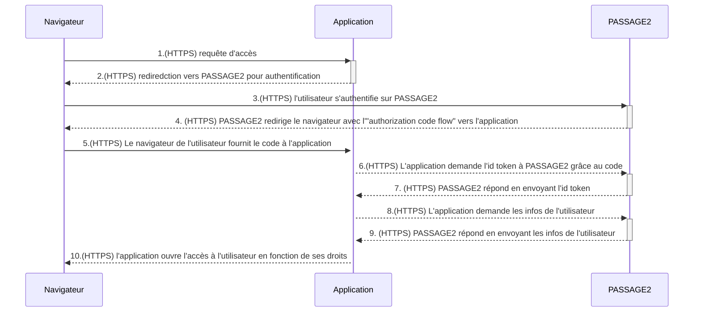

# Gestion des droits des utilisateurs

**_Version CANEL_** : 2.1

## Hypothèses de départ

Les accès à CANEL sont contrôlés selon trois types de profils:
- Application: certaines applications (exemple: DSO) disposent d'un profile de droits indépendant de l'utilisateur opérant cette application.
- Utilisateurs statutaires: utilisateurs identifiés, disposant de rôles applicatifs transverses aux objets gérés dans CANEL (exemple: Architecte d'Entreprise)
- Utilisateurs acteurs: utilisateurs identifiés, disposant de rôles applicatifs dépendant des objets gérés dans CANEL (ex: Souscripteur, Chef de projet, ...)
- Semi Public: utilisateur identifié, ne disposant ni de rôles statutaires, ni de rôles acteurs.

## Authentification d'une application

**Work in progress**
- Les accès via la Console DSO du Cloud PI Native sont supposés de confiance.
- Les appels d'API à partir de la Console DSO permettent de créer éventuellement un acteur correspondant à l'utilisateur connecté à la console, une application correspondant à l'usage de la console, et d'un rôle de "responsable d'application" reliant cet acteur et cette application.

## Authentification/identification d'un utilisateur

- Un utilisateur doit s'authentifier via Passage2.

### Diagramme de séquence générique issu du modèle de DAG

**TODO**: Diagramme ci-dessous issu du modèle de DAG - doit être enrichi avec l'inclusion d'une API GW.

## Application des droits

La description de ces droits décrits dans ce document est limitée aux objets suivants:
- Acteur
- Rôle
- Application
- Conformité
- Environnement
- Instance
- Données de référence

Les droits sont de type CRUD (Create - Read - Update - Delete).
Si un utilisateur dispose de plusieurs rôles sur un objet, les droits appliqués sont les plus ouverts.

### Applications (ex: DSO)

|         | Acteur |                Rôle                |            Application             | Conformité | Environnement |              Instance              | Données de référence |
|---------|--------|------------------------------------|------------------------------------|------------|---------------|------------------------------------|----------------------|
| **DSO** |  CRU   | CRU (sur les applications servies) | CRU (sur les applications servies) |      R     |       R       | CRU (sur les applications servies) |         CRUD         |

### Utilisateurs statutaires

Les profils statutaires sont fournis par le gestionnaire d'identités (PASSAGE2)
Les profils statutaires prévus sont:
- Administrateur
- Direction (incluant la MPSSI)

|                    | Acteur |  Rôle  | Application | Conformité | Environnement | Instance | Données de référence |
|--------------------|--------|--------|-------------|------------|---------------|----------|----------------------|
| **Administrateur** |  CRU   |   CRU  |     CRU     |     CRU    |      CRU      |    CRU   |         CRUD         |
|    **Direction**   |   R    |    R   |      R      |      R     |       R       |     R    |         CRU          |

### Utilisateurs acteurs

Un utilisateur est identifié dans la table "ACT_Actor"; ses droits sont définis par les rôles qu'il porte dans la table "PRJ_ApplicationRole" sur les objets applications.
Les rôles relatifs aux applications sont:
- Chef de Projet/Product Owner [CDP]
- MOA/Business Owner [MOA]
- Architecte Solution [ASOL]
- Architecte Infra [AINF]
- MOE [MOE]
- Resp Production [RPP]
- Support [SUPT]
- RSSI [RSSI]
- Souscripteur [SOUSC]

Un utilisateur identifié peut disposer de droits issus de ce segment, mais être complété par des droits statutaires. Par défaut, il dispose des droits semi-publics.
Remarque: l'accès semi-public permet une lecture sur les applications hors SIV ou SIE. Les accès en lecture permettent donc un accès en lecture sur les applications SIV ou SIE auxquelles l'acteur est associé.

|                                  | Acteur |           Rôle             |         Application        |         Conformité         | Environnement |          Instance          | Données de référence |
|----------------------------------|--------|----------------------------|----------------------------|----------------------------|---------------|----------------------------|----------------------|
| **Chef de Projet/Product Owner** |  CRU   | CRU (sur ses applications) | CRU (sur ses applications) | CRU (sur ses applications) |       R       | CRU (sur ses applications) |          R           |
|      **MOA/Business Owner**      |  CRU   | CRU (sur ses applications) |  R (sur ses applications)  | CRU (sur ses applications) |       R       |  R (sur ses applications)  |          R           |
|     **Architecte Solution**      |   R    |  R (sur ses applications)  | CRU (sur ses applications) | CRU (sur ses applications) |       R       | CRU (sur ses applications) |          R           |
|       **Architecte Infra**       |   R    |  R (sur ses applications)  |  R (sur ses applications)  |  R (sur ses applications)  |       R       | CRU (sur ses applications) |          R           |
|             **MOE**              |   R    |  R (sur ses applications)  | CRU (sur ses applications) | CRU (sur ses applications) |       R       | CRU (sur ses applications) |          R           |
|       **Resp Production**        |   R    |  R (sur ses applications)  |  R (sur ses applications)  |  R (sur ses applications)  |       R       | CRU (sur ses applications) |          R           |
|           **Support**            |   R    |  R (sur ses applications)  |  R (sur ses applications)  |  R (sur ses applications)  |       R       |  R (sur ses applications)  |          R           |
|            **RSSI**              |   R    |  R (sur ses applications)  |  R (sur ses applications)  | CRU (sur ses applications) |       R       |  R (sur ses applications)  |          R           |
|         **Souscripteur**         |  CRU   | CRU (sur ses applications) | CRU (sur ses applications) |  R (sur ses applications)  |       R       | CRU (sur ses applications) |          R           |

### Accès semi-public

Cet accès est donné à un acteur identifié via PASSAGE2 associé à aucun groupe de droits statutaires.

|                 | Acteur | Rôle |     Application     |     Conformité      | Environnement | Instance | Données de référence |
|-----------------|--------|------|---------------------|---------------------|---------------|----------|----------------------|
| **Semi-Public** |   -    |   -  | R (Hors SIE et SIV) | R (Hors SIE et SIV) |       -       |    -     |          R           |

