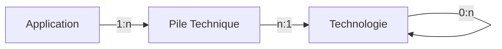

# Gestion des piles techniques

**_Version_** : en cours

**_Discussions_** ouvertes

**_Thèmes manquants ou à renforcer:_**

## Modèle de données

La gestion des piles techniques a pour but de décrire les éléments techniques constituant une application ou une instance d'application.
Pour des raisons de maintenabilité de l'information, nous associerons la pile technique avec les objets Applications par défaut.
Une évolution pourra être d'associer une pile technique avec une instance d'application si cela est maintenable (par exemple dans le cas d'un déploiement via la chaine DSO du Cloud PI Native).

### Objet Technologie

Un objet technologie décrit un composant technologique utilisable dans une application.
Un objet technologie peut avoir un parent. Dans ce cas, le parent est une technologie générique, tandis que les enfants portent les versions.
Une discussion peut apparaitre sur OpenJDK versus les versions Java d'Oracle. Nous considérons que ces deux technologies sont distinctes.

Les attributs fonctionnels sont:

- **Nom** [obligatoire]
- **Description** [facultatif]
- **Version** [facultatif] ce champ devrait être obligatoire pour une technologie avec un parent.
- Lien vers la technologie **parent** [facultatif]
- **Statut CCT** [facultatif] A DISCUTER; peut reprendre les statuts des produits dans le CCT.
- **commentaire** [facultatif]
- données de **création** [obligatoire] - auteur et date de création
- données de **modification** [facultatif] - auteur et date de modification

### Objet Pile technique

Le nom de "Pile technique" est un peu exagéré, car la pile d'une application est un ensemble des présents objets.

Les attributs fonctionnels sont:

- Lien vers une **Application**
- Lien vers une **Technologie**
- **commentaire** [facultatif]
- données de **création** [obligatoire] - auteur et date de création
- données de **modification** [facultatif] - auteur et date de modification

